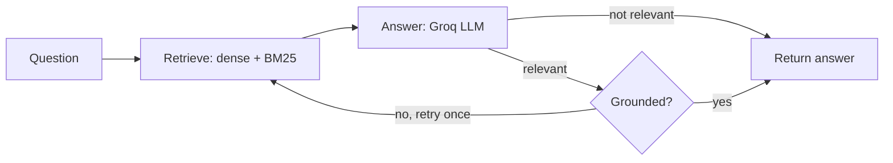

# Research Agent

A backend API that answers questions from a research document and writes structured academic papers. It combines hybrid retrieval, a LangGraph workflow, and an LLM with a built-in grounding check.

Built with FastAPI, LangGraph, ChromaDB and Groq.

## Features

- **Question answering** over an ingested PDF, returned as a short, direct answer.
- **Hybrid retrieval:** dense vector search (ChromaDB) and keyword search (BM25), merged with reciprocal rank fusion.
- **Grounding check:** a second LLM call verifies the answer against the retrieved text, with one automatic retry.
- **Relevance routing:** questions unrelated to the document skip the grounding step to save tokens.
- **Paper generation:** abstract, introduction, literature review, methodology, results, discussion and references, exported as a PDF.
- **Security:** prompt-injection pattern filter on input, output scrubbing, JWT authentication with Argon2-hashed passwords, and Redis-backed rate limiting.
- **Run log:** each request is recorded in a SQLite database.

## How it works

### Question answering



### Paper generation

The paper graph runs the same retrieval and grounding steps first, then writes each section in order, passing earlier sections forward as context:

`retrieve → answer → grounding → abstract → introduction → literature review → methodology → results → discussion → PDF`

## Tech stack

| Layer | Technology |
|---|---|
| API | FastAPI, Uvicorn |
| Workflow | LangGraph |
| LLM | Groq (`openai/gpt-oss-120b`) via LangChain |
| Vector store | ChromaDB |
| Keyword search | rank-bm25 |
| Auth | PyJWT, argon2-cffi |
| Rate limiting | SlowAPI + Redis |
| Database | SQLite via SQLAlchemy |
| PDF export | WeasyPrint |
| Packaging | uv |

## Project structure

```
Research-Agent-/
├── src/research_agent/
│   ├── ingestion/     # load PDF, split into chunks, build the vector index
│   ├── retrieval/     # hybrid search and rank fusion
│   ├── llm/           # Groq client and answer prompt
│   ├── grounded/      # grounding check and retry decision
│   ├── graph/         # full paper-generation workflow
│   ├── qa/            # question-answering workflow
│   ├── nodes/         # paper section nodes (abstract … discussion)
│   ├── state/         # shared graph state
│   ├── security/      # input and output sanitising
│   ├── auth/          # JWT and password hashing
│   ├── database/      # SQLAlchemy models
│   ├── pdf_engine/    # Markdown to PDF
│   └── main/          # FastAPI app and endpoints
├── tests/
├── notebooks/         # original experiments
├── pyproject.toml
└── uv.lock
```

## Getting started

### Prerequisites

- Python 3.14 and [uv](https://docs.astral.sh/uv/)
- Redis, running on `localhost:6379`
- A [Groq](https://console.groq.com) API key
- WeasyPrint system libraries (macOS: `brew install pango`)

### Installation

```bash
git clone https://github.com/Debajyoti02-mac/Research-Agent-.git
cd Research-Agent-
uv sync
```

### Configuration

Create a `.env` file in the repository root:

```
GROQ_API_KEY=your_groq_key
JWT_SECRET=your_long_random_string
```

Generate a secret with:

```bash
python3 -c "import secrets; print(secrets.token_urlsafe(32))"
```

Place the source document at `src/research_agent/economics_research_reference.pdf`. PDFs are gitignored, so this file is not part of the repository.

### Run

```bash
brew services start redis        # macOS; start Redis however you prefer
cd src
uv run uvicorn research_agent.main:app --reload
```

Interactive API docs are available at `http://127.0.0.1:8000/docs`.

> **macOS note:** if WeasyPrint cannot find its libraries, run `export DYLD_FALLBACK_LIBRARY_PATH=/opt/homebrew/lib` before starting the server.

## API

| Method | Endpoint | Auth | Description |
|---|---|---|---|
| GET | `/api/v1/health` | No | Health check |
| POST | `/api/v1/auth/register` | No | Create an account |
| POST | `/api/v1/auth/login` | No | Get an access token (valid for 30 minutes) |
| POST | `/api/v1/ask` | Bearer token | Ask a question about the document |
| POST | `/api/v1/generate-paper` | Bearer token | Generate a paper and download it as a PDF |

### Example

```bash
# 1. Register and log in
curl -X POST http://127.0.0.1:8000/api/v1/auth/register \
  -H "Content-Type: application/json" \
  -d '{"username": "alice", "password": "a-strong-password"}'

curl -X POST http://127.0.0.1:8000/api/v1/auth/login \
  -d "username=alice&password=a-strong-password"
# → {"access_token": "<token>", "token_type": "bearer"}

# 2. Ask a question
curl -X POST http://127.0.0.1:8000/api/v1/ask \
  -H "Authorization: Bearer <token>" \
  -H "Content-Type: application/json" \
  -d '{"question": "What is the policy trilemma?"}'

# 3. Generate a paper
curl -X POST http://127.0.0.1:8000/api/v1/generate-paper \
  -H "Authorization: Bearer <token>" \
  -H "Content-Type: application/json" \
  -d '{"topic": "Central bank credibility", "raw_notes": ""}' \
  --output paper.pdf
```

Response from `/ask`:

```json
{
  "question": "What is the policy trilemma?",
  "answer": "A country cannot have free capital flows, a fixed exchange rate and independent monetary policy at once.",
  "grounded": true
}
```

`grounded` is `true` when the answer was verified against the document, and `false` when the answer came from general knowledge.

## Known limitations

- The vector index is built from a single fixed PDF at startup.
- JWTs cannot be revoked before they expire; there are no refresh tokens yet.
- SQLite is used for the run log, which suits development rather than production.
- Automated tests are still to be written.

## Roadmap

- Upload endpoint with a separate collection per user
- Refresh tokens and logout
- Automated tests and CI
- Docker image and deployment
- LangSmith tracing for cost and quality monitoring

## Author

Debajyoti Hazra — [@Debajyoti02-mac](https://github.com/Debajyoti02-mac)